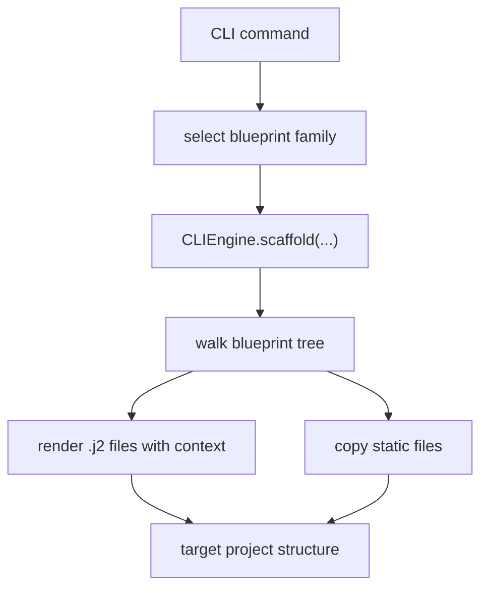

<!-- DOC_TYPE: CONCEPT -->

# CLI Blueprints

## Purpose

The `blueprints/` directory is the generation knowledge base of the CLI.
If `CLIEngine` is the renderer, blueprints are the architectural source material it renders.

They define not only file contents, but also the intended output topology of a generated project.
Because of that, blueprints are closer to a declarative construction system than to a simple templates folder.

## Why Blueprints Matter

The most important thing about the CLI is not the menu itself.
It is the fact that project structure, feature additions, and deployment files are all driven from reusable blueprint trees.

This means the CLI architecture is fundamentally template-centric:

- commands choose a blueprint
- the engine renders it with context
- the generated tree becomes part of the target project

So understanding the CLI means understanding how blueprints are partitioned.

## Top-Level Blueprint Families

The current blueprint space is split into five main families:

- `repo`
- `project`
- `apps`
- `features`
- `deploy`

These are not arbitrary folders.
They correspond to different layers of output responsibility.

### `repo`

`repo/` contains repository-level scaffolding.
This is the outer shell around a generated project and includes files such as:

- `pyproject.toml`
- `README.md`
- `.env.example`
- `.gitignore`
- repo-level docs and tools

This layer answers:
"What files belong to the repository as a whole, regardless of the internal Django app tree?"

### `project`

`project/` contains the base Django project scaffold that lands in `src/<project_name>/`.
This includes the initial structure for:

- `core`
- `system`
- `cabinet`
- `features`
- `templates`
- `static`
- `manage.py`

This is the central blueprint family because it defines the starting runtime architecture of a fresh codex-django project.

### `apps`

`apps/` contains reusable blueprints for adding a standard feature app to an existing project.
The current default app blueprint creates a `features/<app_name>/` structure with the expected internal layout for admin, forms, models, services, templates, tests, and views.

This layer answers:
"How do we add one regular app in the canonical codex-django shape?"

### `features`

`features/` contains advanced or compound feature scaffolds such as:

- `booking`
- `client_cabinet`
- `notifications`

These blueprints are more architectural than `apps/default` because they often modify several target areas at once.

For example:

- booking touches `booking/`, `system/`, `cabinet/`, and public templates
- notifications splits output between a feature area and ARQ infrastructure
- client cabinet injects both cabinet and system-side code

So `features/` is the layer where the CLI expresses cross-cutting feature bundles rather than isolated apps.

### `deploy`

`deploy/` contains deployment-specific scaffolding such as Docker files.
This layer is intentionally separated from `project/` because deployment output has a different lifecycle than runtime application code.

It answers:
"What operational infrastructure should be generated around the project?"

## Architectural Pattern

The blueprint hierarchy reveals an implicit generation model:

1. generate repository shell
2. generate base project
3. optionally add cross-cutting features
4. optionally add standard apps
5. optionally generate deployment support

This is not just a file-copy pipeline.
It is a staged project-construction model.

## Jinja And Structural Semantics

Blueprints are not only raw files:

- `.j2` files are rendered with context
- non-template files are copied as-is
- folder placement encodes where generated code should live

This means the blueprint tree carries two kinds of meaning at once:

- content semantics: what each file should contain
- placement semantics: where in the output architecture it belongs

## Runtime Flow

## Role In The CLI

Blueprints are the most durable part of the CLI architecture.
Menus, commands, and prompts may evolve, but the blueprint families define the long-term contract of what the tool generates.

That is why blueprint documentation is important even if the CLI later becomes its own package:
the blueprints encode the actual shape of the generated ecosystem.
