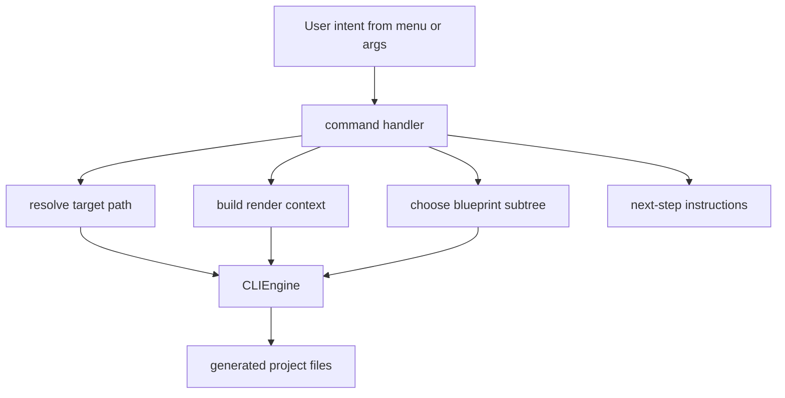

<!-- DOC_TYPE: CONCEPT -->

# CLI Commands

## Purpose

The `commands/` package is the orchestration layer of the CLI.
If `main.py` routes user intent and `CLIEngine` executes rendering, commands translate specific user actions into concrete scaffold operations.

They are not low-level file generators.
They are scenario handlers.

This means each command answers a high-level question such as:

- how to initialize a new project
- how to add a standard app
- how to inject a booking bundle
- how to scaffold notification infrastructure
- how to generate deployment files

## Architectural Role

Commands sit between two different worlds:

- the input world of menus, arguments, and user intent
- the output world of blueprints, generated files, and post-generation instructions

Their role is to:

- choose the right blueprint subtree
- assemble the rendering context
- decide target paths
- coordinate multi-step scaffold flows
- present next steps to the developer

So commands are not just wrappers around `engine.scaffold(...)`.
They encode the semantic meaning of each CLI action.

## Command Families

The current commands already form several architectural groups.

### Project Initialization

`init.py` is the highest-level scaffold operation.
It creates the main project skeleton and may also include optional feature bundles such as:

- cabinet
- booking
- notifications

This command is special because it coordinates several blueprint families in sequence:

- `repo`
- `deploy`
- `project`
- optional feature blueprints

So `init` is not one scaffold action, but a project-construction workflow.

### Standard App Scaffolding

`add_app.py` handles the creation of a regular feature app inside `features/<app_name>/`.
It uses the default app blueprint and assumes the generated project already exists.

This command is the canonical "grow the project by one standard app" path.

### Feature Bundle Commands

Some commands scaffold more than one isolated folder because the feature they represent cuts across several layers of the generated project.

Examples:

- `booking.py`
- `client_cabinet.py`
- `notifications.py`

These commands operate more like feature installers than like simple file generators.

For example:

- booking touches booking code, system settings, cabinet integration, and public templates
- notifications splits output between feature code and ARQ infrastructure
- client cabinet injects cabinet-facing code and system-side profile models

This is an important distinction:
the CLI supports both app scaffolding and architectural feature injection.

### Quality Commands

`quality.py` is not about application structure.
It generates developer workflow support such as `.pre-commit-config.yaml` and related baseline files.

This means the commands package does not only build runtime code.
It also scaffolds developer tooling around the project.

### Deployment Commands

`deploy.py` handles operational infrastructure generation, currently around Docker-based deployment files.
Like quality tooling, this command sits outside the main runtime app tree while still being part of the generated project ecosystem.

## Common Command Pattern

Despite their differences, the commands share one common architectural pattern:

1. receive intent and parameters
2. compute destination paths
3. assemble context
4. call `CLIEngine`
5. print actionable next steps

This gives the CLI a consistent mental model.
Each command defines what is being added, but the flow of command execution stays stable.

## Runtime Flow

## Why Commands Need Documentation

Without command-level documentation, CLI can look like a flat list of actions.
But in reality the commands encode the supported project-evolution model:

- initialize a base project
- expand it with standard apps
- inject bigger architectural features
- add project tooling
- add deployment support

So documenting commands helps explain not only what the CLI can do, but how the repository expects projects to grow over time.

## Relationship To Other CLI Layers

- `main.py` chooses which command handler should run
- `prompts.py` provides the interactive inputs that feed commands
- `CLIEngine` performs the actual file generation requested by commands
- `blueprints/` provides the structural source material consumed by commands

Commands are therefore the semantic center of the CLI:
they interpret intent and convert it into generation work.

## See Also

- [CLI module](./module.md)
- [CLI engine](./engine.md)
- [CLI blueprints](./blueprints.md)
