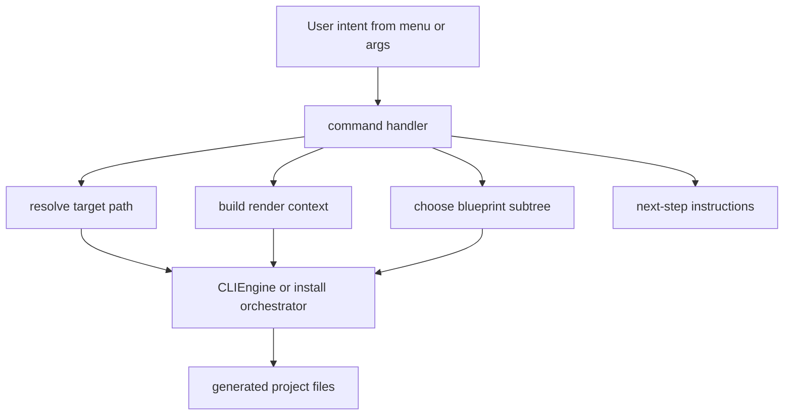

<!-- DOC_TYPE: CONCEPT -->

# CLI Commands

## Purpose

The `commands/` package is the orchestration layer of the CLI.
If `main.py` routes user intent and `CLIEngine` executes rendering, commands translate specific user actions into concrete scaffold operations.

They are not low-level file generators.
They are scenario handlers.

This means each command answers a high-level question such as:

- how to initialize a new project
- how to extend an existing project
- how to generate repository config files
- how to generate deployment files
- how to scaffold quality tooling

## Architectural Role

Commands sit between two different worlds:

- the input world of menus, arguments, and user intent
- the output world of blueprints, generated files, and post-generation instructions

Their role is to:

- choose the right blueprint subtree
- assemble the rendering context
- decide target paths
- coordinate multi-step scaffold flows
- present next steps to the developer

So commands are not just wrappers around `engine.scaffold(...)`.
They encode the semantic meaning of each CLI action.

## Command Families

The current commands form several architectural groups.

### Project Initialization

`init.py` is the top-level public scaffold entrypoint for creating a new project.
It coordinates a new-project workflow and delegates the actual install-layer resolution to the install orchestration layer.

Its public role is simple:

- accept explicit CLI flags
- normalize project options
- launch the new-project scaffold flow

### Install / Extension Orchestration

`install.py` is the scenario layer behind project assembly and extension.
It is responsible for:

- resolving which install layers are implied by the chosen modules
- detecting already-installed project modules
- scaffolding new-project flows
- extending existing projects
- generating compare copies for already-detected modules

This is the command-layer heart of the current scaffold model.
It is not just one feature installer.
It defines how projects grow after the base scaffold exists.

### Repository Config Commands

`repo.py` handles repository-level shell generation such as:

- `pyproject.toml`
- `.env.example`
- other root-level comparison files

This command family sits above the runtime project tree.
It manages the packaging and repository shell around the Django codebase.

### Quality Commands

`quality.py` is not about application structure.
It generates developer workflow support such as `.pre-commit-config.yaml` and related baseline files.

This means the commands package does not only build runtime code.
It also scaffolds developer tooling around the project.

### Deployment Commands

`deploy.py` handles operational infrastructure generation, currently around Docker and CI/CD support.
Like quality tooling, this command sits outside the main runtime app tree while still being part of the generated project ecosystem.

## Common Command Pattern

Despite their differences, the commands share one common architectural pattern:

1. receive intent and parameters
2. compute destination paths
3. assemble context
4. call `CLIEngine` directly or through a helper orchestration layer
5. print actionable next steps

This gives the CLI a consistent mental model.
Each command defines what is being added, but the flow of command execution stays stable.

## Runtime Flow

## Why Commands Need Documentation

Without command-level documentation, CLI can look like a flat list of actions.
But in reality the commands encode the supported project-evolution model:

- initialize a base project
- extend it with install layers
- generate repository shell files
- add project tooling
- add deployment support

So documenting commands helps explain not only what the CLI can do, but how the repository expects projects to grow over time.

## Relationship To Other CLI Layers

- `main.py` chooses which command handler should run
- `prompts.py` provides the interactive inputs that feed commands
- `CLIEngine` performs the actual file generation requested by commands
- `blueprints/` provides the structural source material consumed by commands

Commands are therefore the semantic center of the CLI:
they interpret intent and convert it into generation work.

## See Also

- [CLI module](./module.md)
- [CLI engine](./engine.md)
- [CLI blueprints](./blueprints.md)
