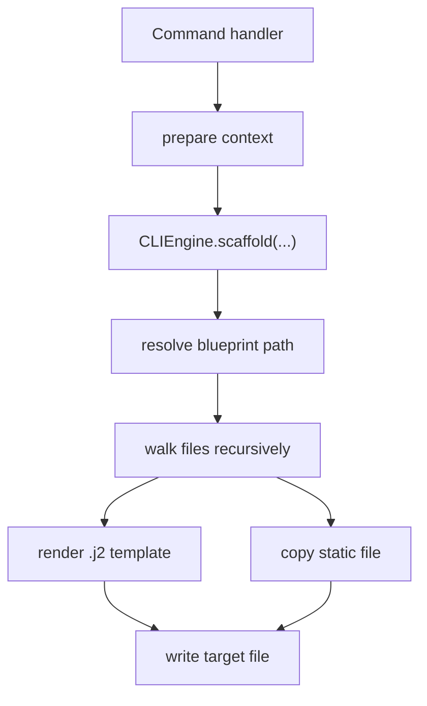

<!-- DOC_TYPE: CONCEPT -->

# CLI Engine

## Purpose

`CLIEngine` is the execution core of the CLI scaffolding system.
If commands decide what should be generated, `CLIEngine` decides how that generation actually happens on disk.

Its responsibility is narrow but central:

- locate blueprint trees
- render Jinja templates
- copy non-template assets
- materialize the generated structure into a target directory

This makes it the operational bridge between abstract blueprint intent and concrete project files.

## Architectural Role

The engine is intentionally separated from:

- interactive prompts
- command selection
- feature-specific business decisions

That separation matters because it keeps the generation mechanism stable even as menus, commands, and blueprint families evolve.

In other words:

- prompts collect decisions
- commands assemble context and choose blueprints
- the engine performs rendering and file emission

This is a classic execution-core pattern.

## Main Responsibilities

### Blueprint Resolution

The engine treats blueprints as a named tree rooted in `cli/blueprints`.
Every scaffold operation begins by resolving a blueprint family such as:

- `repo`
- `project`
- `apps/default`
- `features/booking`
- `deploy`

This makes the engine path-driven rather than command-driven.
Commands remain thin because the engine can operate on any blueprint subtree as long as the path and context are valid.

### Template Rendering

Files ending in `.j2` are rendered through a Jinja2 environment.
The engine loads them relative to the blueprint root and injects the context provided by the command handler.

This means the engine is not tied to specific variables like `project_name` or `app_name`.
It simply renders whatever the selected blueprint expects.

### Static File Copying

Files that are not templates are copied as-is.
This is important because generated projects need both:

- dynamic files derived from context
- static assets and support files that should remain unchanged

So the engine acts as a mixed-mode emitter rather than a pure template renderer.

### Directory Materialization

The engine walks the source blueprint tree recursively and reproduces its structure under the target directory.
That means folder layout in the blueprint tree is treated as part of the contract of generation, not as incidental organization.

The CLI therefore preserves architectural placement through filesystem structure.

### Overwrite Policy

The engine also enforces a simple overwrite policy:

- if a destination file exists and overwrite is disabled, it is skipped
- if overwrite is enabled, it is replaced

This gives commands a predictable and reusable file-conflict behavior without implementing that logic repeatedly in each handler.

## Why The Engine Matters

Without `CLIEngine`, every command would need to know how to:

- walk directories
- detect templates
- render files
- copy assets
- manage destination paths

By isolating this into one class, the CLI architecture gains:

- less duplication
- one consistent rendering model
- one consistent scaffold policy
- easier future extraction into a standalone CLI package

## Runtime Flow

## Design Tradeoffs

The engine is deliberately simple.
It does not currently try to become:

- a dependency graph manager
- a merge-aware patcher
- a semantic project migration tool

Instead, it focuses on reliable tree-based generation.
That simplicity is a strength for scaffolding, because commands can layer more specialized behavior above it when needed.

## Relationship To Other CLI Layers

- `main.py` decides when scaffolding should happen
- `prompts.py` helps collect the user choices that feed command context
- `commands/` decides which blueprint subtree to render and which context to pass
- `blueprints/` contains the structural source material the engine consumes

So the engine sits exactly in the middle of the CLI architecture:
above raw files, below command semantics.

## See Also

- [CLI module](./module.md)
- [CLI blueprints](./blueprints.md)
