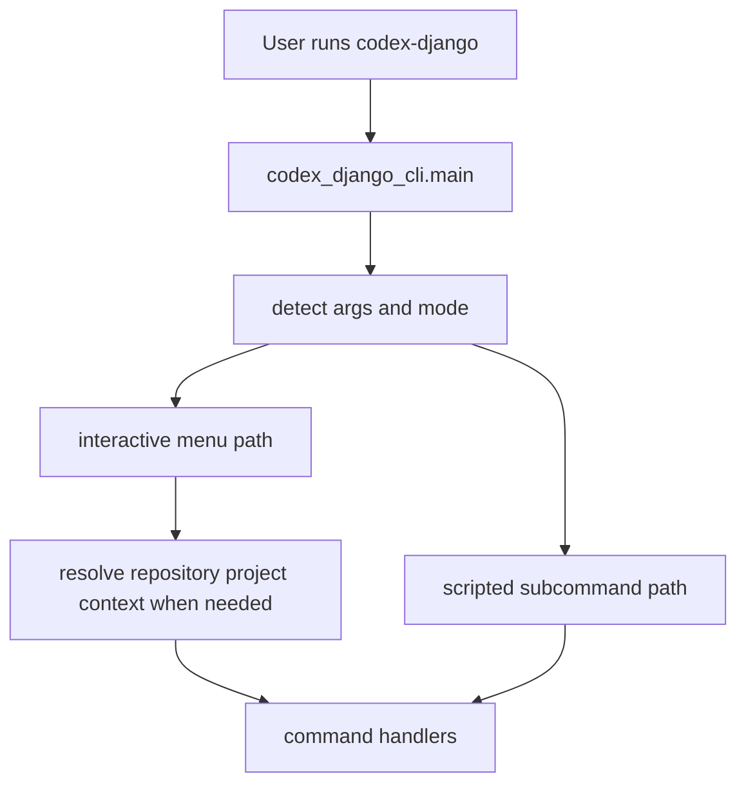

<!-- DOC_TYPE: CONCEPT -->

# CLI Entrypoints

## Purpose

This page explains how users actually enter the CLI system.
If `commands` define the semantic operations and `engine` performs generation, entrypoints define how control reaches those layers in the first place.

In `codex_django_cli`, entrypoints are more important than they first appear because the tool supports multiple interaction modes:

- direct CLI invocation
- interactive menu mode
- scripted subcommand mode
- project selection from `src/` while standing in a repository that contains one or more generated projects

So the entrypoint layer is not just a thin wrapper.
It defines the CLI's operating modes.

## Main Entry Gateway

`main.py` is the central gateway of the CLI.
Its top-level `main()` function decides which path to take based on the incoming arguments.

At a high level it distinguishes between:

- no args: launch interactive behavior
- `menu`: force interactive menu behavior
- scripted args: parse supported subcommands

This already tells us something architectural:
the CLI is designed to be usable both as a guided interactive tool and as a scriptable command-line utility.

## Repository-Scoped Project Selection

One of the important pieces in the current entrypoint layer is project selection from `src/`.
Rather than switching into a completely different project-local binary mode, the CLI scans the repository for generated Django projects and then lets the user:

- choose a target project
- extend that project
- generate deployment or repo-config helpers against that repository context

This gives the CLI a repository-scoped operating model:

- global project creation mode
- project extension mode inside a multi-project repository layout

## Interactive Entrypoints

When the CLI enters interactive mode, `main.py` routes into menu-based flows such as:

- project initialization
- project extension
- deployment generation
- CI/CD workflow generation
- repo config generation
- quality tooling generation

The important point is that menus are not the CLI itself.
They are one entry mode into the command system.

This design keeps the interaction layer replaceable while leaving command semantics stable underneath.

## Scripted Entrypoints

The `_handle_cli_args()` branch exposes classic argparse-driven command access.
This path currently supports direct scripted entry for:

- `init`
- `menu`
- `deploy`

This matters for automation and CI-style usage.
It means the CLI is not locked into human-driven menu flows even though some richer flows remain interactive-first.

Architecturally, this makes the tool hybrid:

- human-friendly in interactive mode
- automation-friendly in scripted mode

## Runtime Boundary

Generated Django projects own runtime commands (`python manage.py ...`) and keep them inside Django management command modules.
The CLI package remains a separate developer tool (`codex-django ...`) for scaffolding and maintenance automation.

This boundary keeps responsibilities clean:

- runtime commands execute in the app process
- CLI commands assemble and evolve project structure

## Operating Model

Putting these pieces together, the entrypoint system follows this model:

1. determine invocation mode
2. route into menu or scripted command handling
3. resolve target project context when needed
4. hand control to command handlers

This means entrypoints are responsible for mode selection and context routing, not for business logic.

## Runtime Flow

## Why Entrypoints Deserve Separate Documentation

Without documenting entrypoints, the CLI can look simpler than it really is.
But the entrypoint layer is where several key architectural promises are enforced:

- one tool can initialize and extend projects from the same binary
- interactive UX and scripted UX can coexist
- repository-scoped project selection stays outside runtime `manage.py` commands

Those are not implementation details.
They are part of the CLI's product design.

## Relationship To Other CLI Layers

- `prompts.py` supports the interactive branch once an entrypoint selects menu mode
- `commands/` takes over after the entrypoint has decided which action should run
- `engine.py` is reached only after entry routing is complete

So entrypoints sit above all the other CLI layers:
they do not perform generation, but they decide how generation becomes reachable.

## See Also

- [CLI module](./module.md)
- [CLI commands](./commands.md)
- [CLI project output](./project-output.md)
