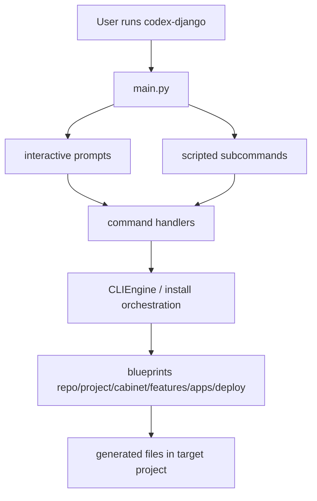

<!-- DOC_TYPE: CONCEPT -->

# CLI Module

## Purpose

`codex_django.cli` is the scaffolding and project-operations layer of the repository.
Unlike the runtime library modules, CLI is responsible for generating project structures, installing feature layers, generating repository shell files, and exposing developer workflows through an interactive or command-driven interface.

It is already architecturally distinct enough that it can be documented as its own subtree.
That matches the long-term direction hinted at in the code and memory notes: CLI may later be extracted into a dedicated library.

## Why CLI Deserves Its Own Tree

CLI is not just one module with a few helper functions.
It has several internal layers:

- entrypoint and menu orchestration
- prompt layer for interactive flows
- rendering/scaffolding engine
- command handlers
- blueprint library
- repo/project/feature/deploy output structures

That makes it structurally different from modules like `booking` or `conversations`, where one concept page is enough as a first pass.

## Main Layers

### 1. Entry Point Layer

`main.py` is the top-level gateway.
It decides whether the CLI runs:

- as an interactive menu
- as a repository-scoped project extension flow
- as a scripted subcommand interface

This is the layer that distinguishes top-level tool behavior from runtime `manage.py` behavior.

### 2. Prompt Layer

`prompts.py` is a thin interactive layer over `questionary`.
Its job is not to implement business logic, but to define menu trees and collect user decisions in a testable way.

This keeps the CLI interaction model separate from scaffolding logic.

### 3. Engine Layer

`engine.py` contains the core rendering engine based on Jinja2 blueprints.
Its role is to:

- resolve blueprint templates
- render `.j2` files with context
- copy static files
- scaffold entire directory trees into target projects

This is the infrastructure heart of the CLI.

### 4. Command Layer

`commands/` now centers around orchestration modules such as:

- `init`
- `install`
- `repo`
- `quality`
- `deploy`

These handlers translate a high-level user action into a concrete scaffolding or setup operation.

### 5. Blueprint Layer

`blueprints/` is the knowledge base of the CLI.
It contains the template trees that define what gets generated.

The blueprint space is segmented into meaningful subdomains:

- `repo`
- `project`
- `cabinet`
- `features`
- `apps`
- `deploy`

This is one of the strongest signs that CLI should be treated as a standalone documentation subtree.

## CLI Documentation Tree

This subtree already covers the main CLI concerns through dedicated pages:

- `entrypoints.md`
- `engine.md`
- `commands.md`
- `blueprints.md`
- `project-output.md`

## Internal Architecture

## Role In The Repository

CLI is the construction layer of `codex-django`.
If the runtime modules define what the library provides after installation, CLI defines how a project is assembled so those modules become usable in practice.

That means the repository has two different architectural dimensions:

- runtime modules such as `core`, `system`, `booking`, `conversations`, `cabinet`
- build/scaffolding module `cli`

This difference is strong enough that CLI should keep its own documentation tree from this point onward.
