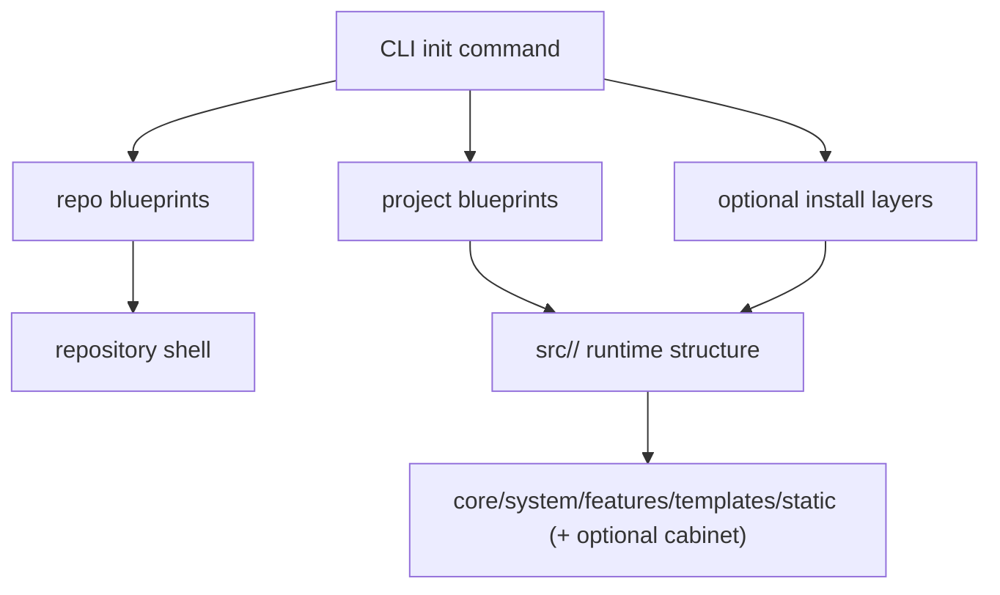

<!-- DOC_TYPE: CONCEPT -->

# CLI Project Output

## Purpose

This page describes the architectural shape of the project that `codex_django.cli` generates.
It is not about how the CLI works internally.
It is about what appears on disk after the main scaffold flow runs.

That distinction matters because the generated project is the actual product the CLI delivers.
If blueprints are the source material and `CLIEngine` is the executor, project output is the resulting architecture developers will live inside.

## Two Output Levels

The CLI produces output on two different levels:

- repository level
- Django project level

These should not be confused.

### Repository Level

At the repository root, CLI can generate the outer project shell:

- `pyproject.toml`
- `.env.example`
- repo docs and tools
- deployment files under `deploy/`
- CI/CD workflows under `.github/workflows/`

This is the operational and packaging layer around the generated application.

### Django Project Level

Inside `src/<project_name>/`, CLI generates the runtime Django project itself.
This is the codebase that actually becomes the application's backend structure.

## Base Generated Runtime Structure

The base project blueprint currently generates a structure centered around these main areas:

- `manage.py`
- `core/`
- `system/`
- `features/`
- `templates/`
- `static/`

This already tells us something important:
the generated project is not a blank Django app.
It is opinionated from the start.

`cabinet/` is no longer just a built-in subsection of the base project blueprint.
It is now a dedicated install layer with its own top-level blueprint family.

## Meaning Of The Main Output Folders

### `core/`

`core/` is the project's framework and settings layer.
It contains:

- settings packages
- urls
- wsgi/asgi entrypoints
- logging/redis helpers
- sitemap wiring

This is the runtime control center of the generated project.

### `system/`

`system/` is the project-state and administrative data layer.
In the generated output it is responsible for:

- site settings
- SEO models/admin
- static content
- management command support
- selectors and service helpers
- error view support

This matches the reusable `system` concepts already present in the library itself.

### `cabinet/`

When the cabinet layer is installed, `cabinet/` appears in the generated project as the project-local shell around the reusable cabinet framework.
It provides project-local glue and customization points such as:

- local cabinet registration
- cabinet views and routing glue
- local services and context processors
- theme and override surface

This is important because cabinet is meant to stay library-driven while still allowing project-level adaptation.

### `features/`

`features/` is the extensibility area of the generated project.
The base project already includes `features/main/`, which acts as the starter feature module for public pages like home and contacts.

Later CLI flows can grow this area with layered feature scaffolds such as:

- conversations
- booking core
- public booking
- lower-level app scaffolds when needed

So `features/` is the main growth surface of the scaffolded project.

### `templates/`

`templates/` contains shared project templates such as:

- the base layout
- includes
- public pages
- error pages
- optional service-worker and manifest output templates

This layer defines the shared rendering surface of the generated project.
It is distinct from the library-owned cabinet templates while still cooperating with the cabinet layer when that layer is installed.

### `static/`

`static/` contains the front-end asset structure for the generated project.
Notably, it already has a layered CSS setup and compiler configuration, which means front-end organization is also scaffolded as an architectural choice rather than left entirely ad hoc.

## Optional Output Expansion

The base project can be expanded at generation time with optional modules such as:

- cabinet
- conversations
- booking core
- public booking
- service-worker assets

These do not simply add one folder each.
They may inject files into multiple target areas.

Examples:

- cabinet adds project-local cabinet structure, assets, templates, and routing glue
- conversations adds feature code plus cabinet-facing integration
- booking expands domain code, cabinet builders, and public booking pages
- service-worker support adds manifest and `sw.js` assets into the project output

So generated output is layered:

1. repository shell
2. base project shell
3. optional install layers
4. later incremental scaffold commands

## Generated Project As Architecture

The key architectural point is this:
the CLI does not generate a neutral Django skeleton.
It generates a codex-django-shaped project with explicit assumptions about:

- where core settings live
- where admin/system state lives
- how features are organized
- how public templates are separated from cabinet UI
- how deploy support is layered around the project

That is why project output deserves its own documentation page.

## Runtime Flow

## Relationship To Other CLI Pages

- `blueprints.md` explains the source families that define this output
- `engine.md` explains how the output is materialized
- `commands.md` explains which actions create or extend this output

This page is the "what you end up with" view of the CLI architecture.

## See Also

- [CLI module](./module.md)
- [CLI blueprints](./blueprints.md)
- [CLI commands](./commands.md)
