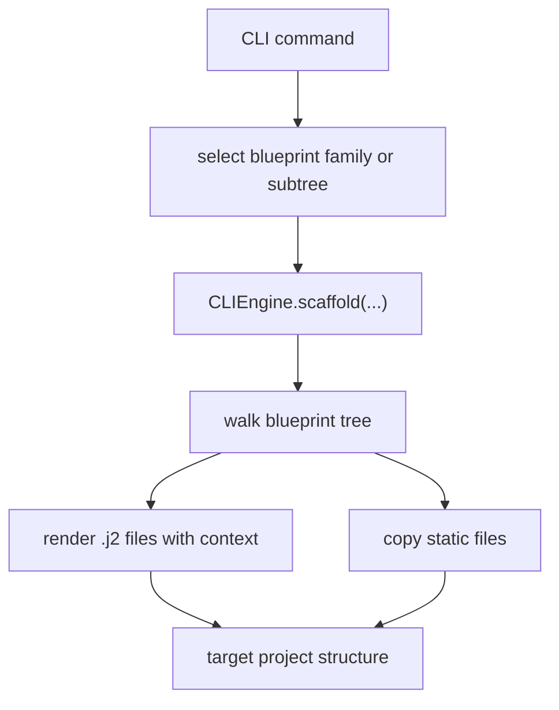

<!-- DOC_TYPE: CONCEPT -->

# CLI Blueprints

## Назначение

Директория `blueprints/` это база знаний генерации для CLI.
Если `CLIEngine` выступает как renderer, то blueprints это тот архитектурный материал, который он рендерит.

Они задают не только содержимое файлов, но и саму топологию выходного проекта.
Поэтому blueprints ближе к декларативной системе сборки, чем к обычной папке с шаблонами.

## Почему Blueprints Так Важны

Самое важное в CLI это не само меню.
Самое важное то, что структура проекта, расширение уже существующего проекта, генерация repository shell и deploy-файлы строятся из переиспользуемых blueprint-деревьев.

Это означает, что архитектура CLI по своей сути template-centric:

- commands выбирают blueprint family или subtree
- engine рендерит его с context
- сгенерированное дерево становится частью целевого репозитория или проекта

Поэтому понять CLI значит понять, как разделены blueprints.

## Верхнеуровневые Семейства Blueprints

Сейчас пространство blueprints разделено на шесть основных семейств:

- `repo`
- `project`
- `cabinet`
- `features`
- `apps`
- `deploy`

Это не случайные папки.
Они соответствуют разным уровням ответственности в выходной структуре.

### `repo`

`repo/` содержит repository-level scaffolding.
Это внешняя оболочка сгенерированного проекта, в которую входят файлы вроде:

- `pyproject.toml`
- `.env.example`
- repo-level docs и tools
- shared repository helper templates

Этот слой отвечает на вопрос:
"Какие файлы относятся ко всему репозиторию в целом, независимо от внутреннего Django app tree?"

### `project`

`project/` содержит базовый Django project scaffold, который попадает в `src/<project_name>/`.
Сюда входят стартовые структуры для:

- `core`
- `system`
- `features`
- `templates`
- `static`
- `manage.py`

Это семейство задает исходную runtime-архитектуру нового codex-django проекта до подключения опциональных install-слоев.

### `cabinet`

`cabinet/` теперь это отдельное верхнеуровневое blueprint-family.
Оно содержит project-local cabinet shell, views, services, templates, static assets и routing glue, которые раньше были частично спрятаны внутри `project/`.

Это важно, потому что cabinet больше не выглядит как неявная часть базового scaffold.
Теперь это явный extension-layer, который можно устанавливать, переустанавливать и сравнивать отдельно.

### `features`

`features/` содержит advanced или compound feature scaffolds, например:

- `booking`
- `booking_core`
- `booking_public`
- `conversations`
- `client_cabinet`

Эти blueprints архитектурно шире, чем `apps/default`, потому что часто затрагивают сразу несколько целевых зон.

Например:

- `booking_core` задает booking domain и service layer
- `booking_public` добавляет public booking pages и multi-step templates
- `conversations` внедряет feature code плюс cabinet-facing integration
- `client_cabinet` остается частью blueprint-tree как специализированный cabinet-facing extension surface

Поэтому `features/` это слой, где CLI выражает не отдельные приложения, а cross-cutting feature bundles.

### `apps`

`apps/` содержит переиспользуемые blueprints для добавления обычного feature app в уже существующий проект.
В текущей форме CLI это уже не главный interactive growth path, но это семейство остается частью blueprint library как lower-level reusable scaffold family.

Этот слой отвечает на вопрос:
"Как добавить один обычный app в канонической форме codex-django, когда нужен именно такой lower-level pattern?"

### `deploy`

`deploy/` содержит scaffolding для deployment-инфраструктуры, например Docker-файлы и workflow templates.
Этот слой вынесен отдельно от `project/`, потому что operational output живет по другому lifecycle, чем runtime application code.

Он отвечает на вопрос:
"Какая эксплуатационная инфраструктура должна быть сгенерирована вокруг проекта?"

## Архитектурный Паттерн

Иерархия blueprints показывает скрытую модель генерации:

1. при необходимости сгенерировать repository shell
2. сгенерировать базовый project
3. при необходимости установить cabinet и feature layers
4. при необходимости сгенерировать deploy или CI/CD support
5. при необходимости использовать lower-level app blueprints

Это не просто pipeline копирования файлов.
Это staged project-construction model.

## Jinja И Структурная Семантика

Blueprints это не просто набор файлов:

- `.j2` файлы рендерятся по context
- обычные файлы копируются как есть
- расположение папок кодирует, куда generated code должен попасть

Это значит, что дерево blueprints одновременно несет два вида смысла:

- content semantics: что должно быть внутри файла
- placement semantics: где этот файл должен оказаться в итоговой архитектуре

## Runtime Flow

## Роль В CLI

Blueprints это самая долговечная часть CLI-архитектуры.
Menus, commands и prompts могут меняться, но именно blueprint families задают долгосрочный контракт того, что инструмент умеет генерировать.

Поэтому документация по blueprints важна даже в случае, если CLI позже станет отдельным пакетом:
именно blueprints кодируют реальную форму генерируемой экосистемы.

## См. Также

- [CLI module](./module.md)
