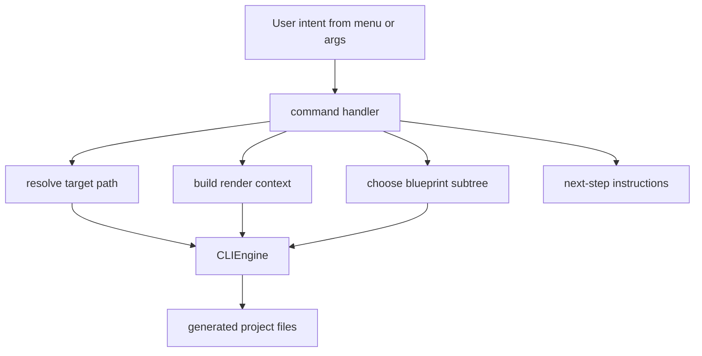

<!-- DOC_TYPE: CONCEPT -->

# CLI Commands

## Назначение

Пакет `commands/` это orchestration-layer внутри CLI.
Если `main.py` маршрутизирует пользовательское намерение, а `CLIEngine` выполняет рендеринг, то commands переводят конкретное действие пользователя в реальную операцию scaffolding.

Это не низкоуровневые генераторы файлов.
Это scenario handlers.

То есть каждая команда отвечает на высокоуровневый вопрос вроде:

- как инициализировать новый проект
- как добавить обычный app
- как внедрить booking bundle
- как scaffold'ить notification infrastructure
- как сгенерировать deployment files

## Архитектурная Роль

Commands находятся между двумя мирами:

- входным миром menus, arguments и user intent
- выходным миром blueprints, generated files и post-generation instructions

Их задача:

- выбрать нужный blueprint subtree
- собрать rendering context
- определить target paths
- скоординировать multi-step scaffold flow
- показать разработчику дальнейшие шаги

Поэтому commands это не просто обертки вокруг `engine.scaffold(...)`.
Именно они кодируют семантику конкретного CLI-действия.

## Семейства Команд

Уже сейчас команды складываются в несколько архитектурных групп.

### Инициализация Проекта

`init.py` это самая высокоуровневая scaffold-операция.
Он создает основной project skeleton и при необходимости добавляет optional feature bundles, например:

- cabinet
- booking
- notifications

Эта команда особенная, потому что координирует несколько blueprint families подряд:

- `repo`
- `deploy`
- `project`
- optional feature blueprints

То есть `init` это не одна операция scaffold, а полноценный project-construction workflow.

### Стандартный App Scaffolding

`add_app.py` отвечает за создание обычного feature app внутри `features/<app_name>/`.
Он использует default app blueprint и предполагает, что проект уже существует.

Это канонический путь "расширить проект еще одним стандартным приложением".

### Команды Feature Bundles

Некоторые команды scaffold'ят не одну изолированную папку, а сразу несколько целевых зон, потому что соответствующая фича архитектурно проходит через несколько слоев проекта.

Примеры:

- `booking.py`
- `client_cabinet.py`
- `notifications.py`

Такие команды работают скорее как feature installers, а не как простые file generators.

Например:

- booking затрагивает booking-код, system settings, cabinet integration и public templates
- notifications делят output между feature code и ARQ-инфраструктурой
- client cabinet внедряет код и в cabinet, и в system

Это важное различие:
CLI поддерживает и app scaffolding, и внедрение архитектурных feature bundles.

### Команды Качества

`quality.py` не занимается структурой runtime-приложения.
Он генерирует developer workflow support, например `.pre-commit-config.yaml` и baseline-файлы.

Это показывает, что commands-package строит не только runtime code, но и окружение разработчика вокруг проекта.

### Команды Деплоя

`deploy.py` отвечает за генерацию operational infrastructure, сейчас главным образом deployment-файлов вокруг Docker.
Как и quality tooling, этот command находится вне основного runtime app tree, но при этом остается частью экосистемы generated project.

## Общий Паттерн Команд

Несмотря на различия, у команд есть общий архитектурный паттерн:

1. принять intent и параметры
2. вычислить destination paths
3. собрать context
4. вызвать `CLIEngine`
5. напечатать понятные next steps

Из-за этого у CLI получается единая ментальная модель.
Каждая команда определяет, что именно добавляется, но сам flow выполнения остается стабильным.

## Runtime Flow

## Почему Команды Нужно Документировать

Без отдельной документации commands CLI выглядит как плоский список действий.
Но на деле именно commands кодируют поддерживаемую модель роста проекта:

- инициализировать базовый проект
- расширять его обычными apps
- внедрять более крупные архитектурные features
- добавлять developer tooling
- добавлять deployment support

Поэтому documentation по commands объясняет не только то, что CLI умеет делать, но и то, как репозиторий ожидает эволюцию проекта во времени.

## Связь С Другими Слоями CLI

- `main.py` выбирает, какой command handler должен запуститься
- `prompts.py` дает интерактивные входные данные для commands
- `CLIEngine` выполняет реальную генерацию файлов по запросу commands
- `blueprints/` дают структурный материал, который commands используют

То есть commands это семантический центр CLI:
они интерпретируют intent и превращают его в generation work.

## См. Также

- [CLI module](./module.md)
- [CLI engine](./engine.md)
- [CLI blueprints](./blueprints.md)
