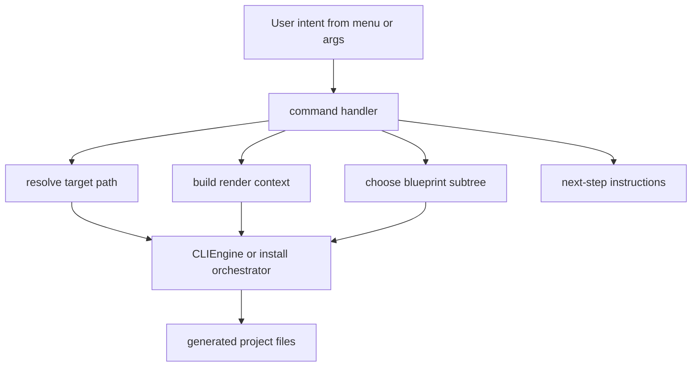

<!-- DOC_TYPE: CONCEPT -->

# CLI Commands

## Назначение

Пакет `commands/` это orchestration-layer внутри CLI.
Если `main.py` маршрутизирует пользовательское намерение, а `CLIEngine` выполняет рендеринг, то commands переводят конкретное действие пользователя в реальную операцию scaffolding.

Это не низкоуровневые генераторы файлов.
Это scenario handlers.

То есть каждая команда отвечает на высокоуровневый вопрос вроде:

- как инициализировать новый проект
- как расширить существующий проект
- как сгенерировать repository config files
- как сгенерировать deployment files
- как scaffold'ить quality tooling

## Архитектурная Роль

Commands находятся между двумя мирами:

- входным миром menus, arguments и user intent
- выходным миром blueprints, generated files и post-generation instructions

Их задача:

- выбрать нужный blueprint subtree
- собрать rendering context
- определить target paths
- скоординировать multi-step scaffold flow
- показать разработчику дальнейшие шаги

Поэтому commands это не просто обертки вокруг `engine.scaffold(...)`.
Именно они кодируют семантику конкретного CLI-действия.

## Семейства Команд

Текущие команды складываются в несколько архитектурных групп.

### Инициализация Проекта

`init.py` это верхнеуровневый публичный scaffold-entrypoint для создания нового проекта.
Он координирует new-project workflow и делегирует разбор install-слоев orchestration-слою установки.

Его публичная роль проста:

- принять явные CLI-флаги
- нормализовать project options
- запустить new-project scaffold flow

### Install / Extension Orchestration

`install.py` это сценарный слой за сборкой и расширением проекта.
Он отвечает за:

- вычисление install-слоев, которые следуют из выбранных модулей
- detection уже установленных project modules
- scaffolding new-project flows
- расширение existing projects
- генерацию compare copy для уже найденных модулей

Это сердцевина command-layer в текущей scaffold-модели.
Это уже не просто один feature installer.
Именно здесь описано, как проект растет после появления базового scaffold.

### Команды Repository Config

`repo.py` отвечает за генерацию repository-level shell, например:

- `pyproject.toml`
- `.env.example`
- других root-level comparison files

Это command-family, который находится над runtime project tree.
Он управляет packaging и repository shell вокруг Django-кодовой базы.

### Команды Качества

`quality.py` не занимается структурой runtime-приложения.
Он генерирует developer workflow support, например `.pre-commit-config.yaml` и related baseline files.

Это показывает, что commands-package строит не только runtime code, но и окружение разработчика вокруг проекта.

### Команды Деплоя

`deploy.py` отвечает за генерацию operational infrastructure, сейчас вокруг Docker и CI/CD support.
Как и quality tooling, этот command находится вне основного runtime app tree, но при этом остается частью generated project ecosystem.

## Общий Паттерн Команд

Несмотря на различия, у команд есть общий архитектурный паттерн:

1. принять intent и параметры
2. вычислить destination paths
3. собрать context
4. вызвать `CLIEngine` напрямую или через helper orchestration layer
5. напечатать понятные next steps

Из-за этого у CLI получается единая ментальная модель.
Каждая команда определяет, что именно добавляется, но сам flow выполнения остается стабильным.

## Runtime Flow

## Почему Команды Нужно Документировать

Без отдельной документации commands CLI выглядит как плоский список действий.
Но на деле именно commands кодируют поддерживаемую модель роста проекта:

- инициализировать базовый проект
- расширять его install-слоями
- генерировать repository shell files
- добавлять developer tooling
- добавлять deployment support

Поэтому documentation по commands объясняет не только то, что CLI умеет делать, но и то, как репозиторий ожидает эволюцию проекта во времени.

## Связь С Другими Слоями CLI

- `main.py` выбирает, какой command handler должен запуститься
- `prompts.py` дает интерактивные входные данные для commands
- `CLIEngine` выполняет реальную генерацию файлов по запросу commands
- `blueprints/` дают структурный материал, который commands используют

То есть commands это семантический центр CLI:
они интерпретируют intent и превращают его в generation work.

## См. Также

- [CLI module](./module.md)
- [CLI engine](./engine.md)
- [CLI blueprints](./blueprints.md)
