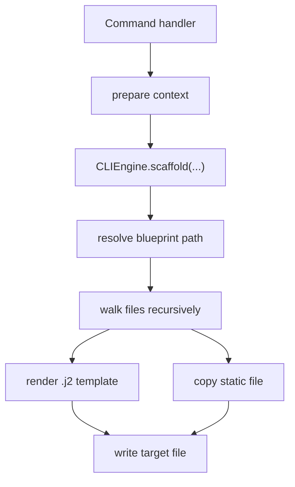

<!-- DOC_TYPE: CONCEPT -->

# CLI Engine

## Назначение

`CLIEngine` это исполняющее ядро системы скаффолдинга в CLI.
Если commands решают, что именно нужно сгенерировать, то `CLIEngine` решает, как это поколение реально происходит на файловой системе.

Его ответственность узкая, но центральная:

- находить деревья blueprints
- рендерить Jinja templates
- копировать non-template assets
- материализовывать итоговую структуру в target directory

Из-за этого именно он становится операционным мостом между абстрактным blueprint intent и конкретными файлами проекта.

## Архитектурная Роль

Engine специально отделен от:

- интерактивных prompts
- выбора команд
- feature-specific бизнес-решений

Это разделение важно, потому что сам механизм генерации остается стабильным даже тогда, когда меняются меню, команды или семейства blueprints.

Иными словами:

- prompts собирают решения
- commands готовят context и выбирают blueprints
- engine выполняет рендеринг и запись файлов

Это типичный execution-core pattern.

## Основные Обязанности

### Разрешение Blueprints

Engine работает с blueprints как с именованным деревом, корень которого находится в `cli/blueprints`.
Каждая операция scaffold начинается с разрешения одного blueprint path, например:

- `repo`
- `project`
- `apps/default`
- `features/booking`
- `deploy`

За счет этого engine остается path-driven, а не command-driven.
Commands могут быть тонкими, потому что engine умеет одинаково работать с любым blueprint subtree, если ему передать путь и context.

### Рендеринг Шаблонов

Файлы с окончанием `.j2` рендерятся через Jinja2 environment.
Engine загружает их относительно корня blueprints и подставляет context, собранный command handler.

Это означает, что engine не привязан к конкретным переменным вроде `project_name` или `app_name`.
Он просто рендерит то, что ожидает выбранный blueprint.

### Копирование Статических Файлов

Файлы, которые не являются шаблонами, копируются как есть.
Это важно, потому что generated project почти всегда состоит из двух типов артефактов:

- динамические файлы, зависящие от context
- статические assets и support files, которые должны попасть в проект без изменений

Поэтому engine выступает как mixed-mode emitter, а не просто как template renderer.

### Материализация Структуры Директорий

Engine рекурсивно проходит по source blueprint tree и воспроизводит его структуру внутри target directory.
То есть layout папок в blueprint tree рассматривается как часть контракта генерации, а не как случайная внутренняя организация.

Так CLI сохраняет архитектурное размещение через саму файловую структуру.

### Политика Overwrite

Engine также централизованно реализует простую overwrite-политику:

- если destination file уже существует и overwrite выключен, файл пропускается
- если overwrite включен, файл перезаписывается

Это дает всем commands единое и предсказуемое поведение при конфликтах файлов, без повторной реализации этой логики в каждом handler.

## Почему Engine Так Важен

Без `CLIEngine` каждой команде пришлось бы заново уметь:

- обходить директории
- различать шаблоны и обычные файлы
- рендерить шаблоны
- копировать assets
- управлять destination paths

За счет вынесения всего этого в один класс архитектура CLI получает:

- меньше дублирования
- единую модель рендеринга
- единую scaffold-политику
- более легкий путь к будущему выделению CLI в отдельный пакет

## Runtime Flow

## Дизайн-Компромиссы

Engine намеренно сделан простым.
Сейчас он не пытается стать:

- dependency graph manager
- merge-aware patcher
- semantic project migration tool

Вместо этого он сфокусирован на надежной tree-based генерации.
Для scaffolding-задач это скорее плюс, потому что более сложное поведение при необходимости можно наращивать поверх него на уровне commands.

## Связь С Другими Слоями CLI

- `main.py` решает, когда вообще должен запуститься scaffold-процесс
- `prompts.py` помогает собрать пользовательские решения для context
- `commands/` определяют, какой blueprint subtree рендерить и какой context передавать
- `blueprints/` содержат структурный материал, который engine потребляет

То есть engine находится ровно в центре архитектуры CLI:
выше сырой файловой структуры, но ниже семантики конкретных команд.

## См. Также

- [CLI module](./module.md)
- [CLI blueprints](./blueprints.md)
