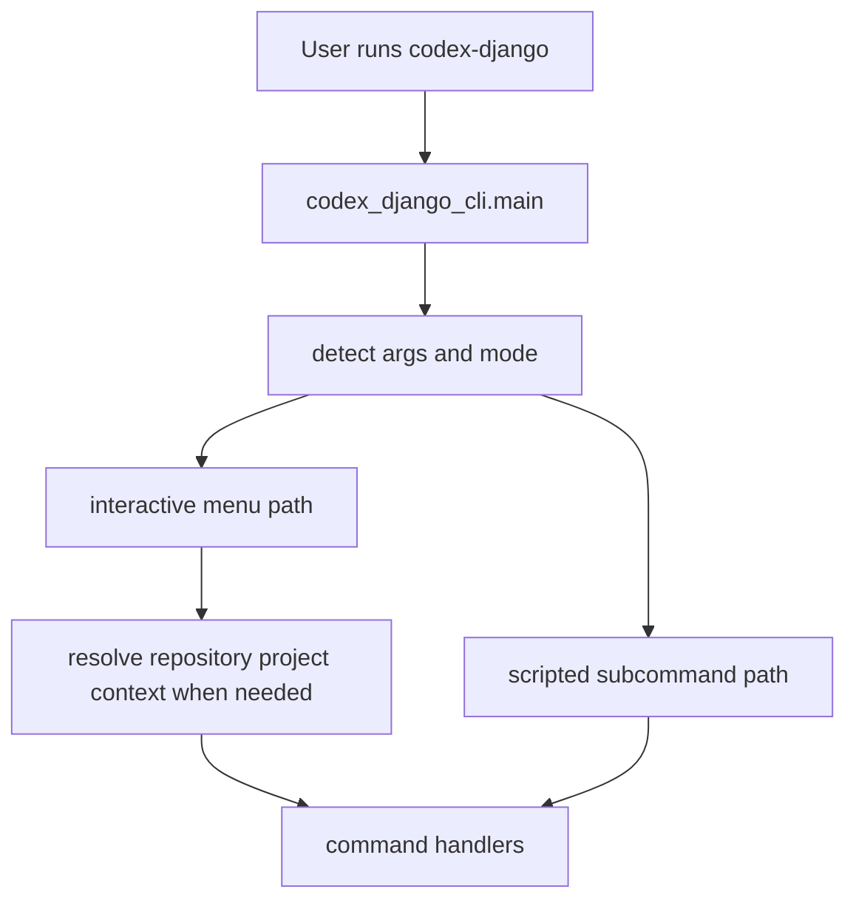

<!-- DOC_TYPE: CONCEPT -->

# CLI Entrypoints

## Назначение

Эта страница объясняет, как пользователь вообще входит в систему CLI.
Если `commands` задают семантические операции, а `engine` выполняет генерацию, то entrypoints определяют, каким путем управление вообще доходит до этих слоев.

В `codex_django_cli` entrypoints важнее, чем может показаться, потому что инструмент поддерживает несколько режимов взаимодействия:

- прямой запуск CLI
- интерактивный menu mode
- scripted subcommand mode
- выбор проекта из `src/` внутри репозитория, где уже есть один или несколько generated projects

То есть entrypoint-layer здесь это не просто тонкая обертка.
Он реально задает режимы работы CLI.

## Главная Точка Входа

`main.py` это центральный gateway CLI.
Его верхнеуровневая функция `main()` решает, какой путь выбрать, опираясь на входные аргументы.

На высоком уровне он различает:

- нет аргументов: запустить интерактивное поведение
- `menu`: принудительно запустить menu-поведение
- scripted args: разобрать поддерживаемые subcommands

Уже отсюда видно важное архитектурное решение:
CLI спроектирован так, чтобы одинаково хорошо работать и как guided interactive tool, и как scriptable command-line utility.

## Выбор Проекта На Уровне Репозитория

Одна из важных частей текущего entrypoint-layer это выбор проекта из `src/`.
Вместо отдельного project-local binary mode CLI сканирует репозиторий на наличие generated Django projects и затем позволяет:

- выбрать целевой проект
- расширить этот проект
- запускать deploy и repo-config сценарии в контексте этого репозитория

Из-за этого у CLI получается repository-scoped operating model:

- глобальный режим создания проекта
- режим расширения проекта внутри multi-project repository layout

## Интерактивные Entrypoints

Когда CLI входит в interactive mode, `main.py` маршрутизирует выполнение в menu-based flows, например:

- инициализация проекта
- расширение проекта
- генерация deployment files
- генерация CI/CD workflows
- генерация repo config files
- генерация quality tooling

Здесь важно понимать: меню это не сам CLI.
Это только один из входных режимов в систему команд.

Такой дизайн делает interaction-layer заменяемым, сохраняя при этом стабильную семантику команд под ним.

## Scripted Entrypoints

Ветка `_handle_cli_args()` открывает классический argparse-driven доступ к командам.
Этот путь сейчас поддерживает прямые scripted entry для:

- `init`
- `menu`
- `deploy`

Это важно для automation и CI-style использования.
То есть CLI не заперт только в human-driven menu flows, хотя более богатые сценарии пока остаются interactive-first.

Архитектурно это делает инструмент гибридным:

- human-friendly в interactive mode
- automation-friendly в scripted mode

## Runtime Граница

Сгенерированный Django-проект владеет runtime-командами (`python manage.py ...`) через обычные management commands.
CLI-пакет остается отдельным developer-инструментом (`codex-django ...`) для сборки и эволюции структуры проекта.

Такое разделение удерживает роли чистыми:

- runtime-команды работают внутри процесса приложения
- CLI-команды занимаются scaffold/сборкой структуры

## Операционная Модель

Если собрать все вместе, entrypoint-system работает так:

1. определить режим запуска
2. маршрутизировать в menu или scripted command handling
3. при необходимости определить target project context
4. передать управление command handlers

То есть entrypoints отвечают за выбор режима и маршрутизацию контекста, а не за бизнес-логику.

## Runtime Flow

## Почему Entrypoints Нужны Отдельно

Без отдельной документации entrypoints CLI кажется проще, чем он есть на самом деле.
Но именно на этом уровне зафиксированы несколько ключевых архитектурных обещаний:

- один инструмент может инициализировать и расширять проекты из одного binary
- interactive UX и scripted UX могут сосуществовать
- repository-scoped project selection остается вне runtime `manage.py` commands

Это не мелкие детали реализации.
Это часть продуктового дизайна CLI.

## Связь С Другими Слоями CLI

- `prompts.py` поддерживает interactive-ветку после того, как entrypoint выбрал menu mode
- `commands/` подхватывают выполнение после того, как entrypoint решил, какое действие запускать
- `engine.py` достигается только после завершения маршрутизации entrypoint-layer

То есть entrypoints находятся выше всех остальных CLI-слоев:
они не генерируют файлы сами, но именно они решают, как генерация становится достижимой.

## См. Также

- [CLI module](./module.md)
- [CLI commands](./commands.md)
- [CLI project output](./project-output.md)
