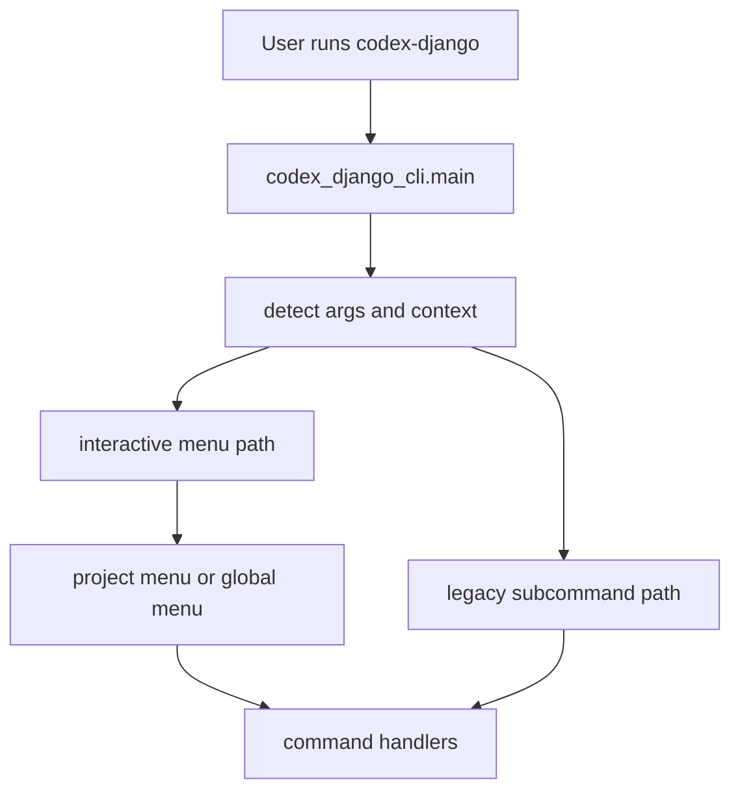

<!-- DOC_TYPE: CONCEPT -->

# CLI Entrypoints

## Назначение

Эта страница объясняет, как пользователь вообще входит в систему CLI.
Если `commands` задают семантические операции, а `engine` выполняет генерацию, то entrypoints определяют, каким путем управление вообще доходит до этих слоев.

В `codex_django_cli` entrypoints важнее, чем может показаться, потому что инструмент поддерживает несколько режимов взаимодействия:

- прямой запуск CLI
- интерактивный menu mode
- scripted subcommand mode
- project-local запуск `codex-django` из директории уже сгенерированного проекта

То есть entrypoint-layer здесь это не просто тонкая обертка.
Он реально задает режимы работы CLI.

## Главная Точка Входа

`main.py` это центральный gateway CLI.
Его верхнеуровневая функция `main()` решает, какой путь выбрать, опираясь на входные аргументы и текущий рабочий контекст.

На высоком уровне он различает:

- нет аргументов: запустить интерактивное поведение
- `menu`: принудительно запустить menu-поведение
- legacy args: разобрать subcommands

Уже отсюда видно важное архитектурное решение:
CLI спроектирован так, чтобы одинаково хорошо работать и как guided interactive tool, и как scriptable command-line utility.

## Контекстно-Зависимый Вход

Одна из самых важных частей entrypoint-layer это `_is_in_project()`.
Эта функция проверяет, похожа ли текущая рабочая директория на scaffolded codex-django project.

Это значит, что один и тот же CLI binary может менять поведение в зависимости от того, откуда его запустили:

- вне проекта: global menu
- внутри generated project: project menu

Так формируется двойная модель работы:

- глобальный режим создания проекта
- локальный режим поддержки и расширения уже созданного проекта

## Интерактивные Entrypoints

Когда CLI входит в interactive mode, `main.py` маршрутизирует выполнение в menu-based flows, например:

- глобальная инициализация
- project commands
- scaffolding menus
- quality/deploy/security menus

Здесь важно понимать: меню это не сам CLI.
Это только один из входных режимов в систему команд.

Такой дизайн делает interaction-layer заменяемым, сохраняя при этом стабильную семантику команд под ним.

## Legacy / Scripted Entrypoints

Ветка `_handle_legacy_args()` открывает классический argparse-driven доступ к командам.
Этот путь поддерживает прямые subcommands, например:

- `init`
- `add-app`
- `add-notifications`
- `add-client-cabinet`
- `add-booking`

Это важно для automation и CI-style использования.
То есть CLI не заперт только в human-driven menu flows.

Архитектурно это делает инструмент гибридным:

- human-friendly в interactive mode
- automation-friendly в scripted mode

## Runtime Граница

Сгенерированный Django-проект владеет runtime-командами (`python manage.py ...`) через обычные management commands.
CLI-пакет остается отдельным developer-инструментом (`codex-django ...`) для сборки и эволюции структуры проекта.

Такое разделение удерживает роли чистыми:

- runtime-команды работают внутри процесса приложения
- CLI-команды занимаются scaffold/сборкой структуры

## Операционная Модель

Если собрать все вместе, entrypoint-system работает так:

1. определить режим запуска
2. определить, глобальный это контекст или project-local
3. маршрутизировать в menu или scripted command handling
4. передать управление command handlers

То есть entrypoints отвечают за выбор режима, а не за бизнес-логику.

## Runtime Flow

## Почему Entrypoints Нужны Отдельно

Без отдельной документации entrypoints CLI кажется проще, чем он есть на самом деле.
Но именно на этом уровне зафиксированы несколько ключевых архитектурных обещаний:

- один инструмент может работать и глобально, и внутри проекта
- interactive UX и scripted UX могут сосуществовать
- generated projects остаются связанными с CLI после scaffold

Это не мелкие детали реализации.
Это часть продуктового дизайна CLI.

## Связь С Другими Слоями CLI

- `prompts.py` поддерживает interactive-ветку после того, как entrypoint выбрал menu mode
- `commands/` подхватывают выполнение после того, как entrypoint решил, какое действие запускать
- `engine.py` достигается только после завершения маршрутизации entrypoint-layer

То есть entrypoints находятся выше всех остальных CLI-слоев:
они не генерируют файлы сами, но именно они решают, как генерация становится достижимой.

## См. Также

- [CLI module](./module.md)
- [CLI commands](./commands.md)
- [CLI project output](./project-output.md)
