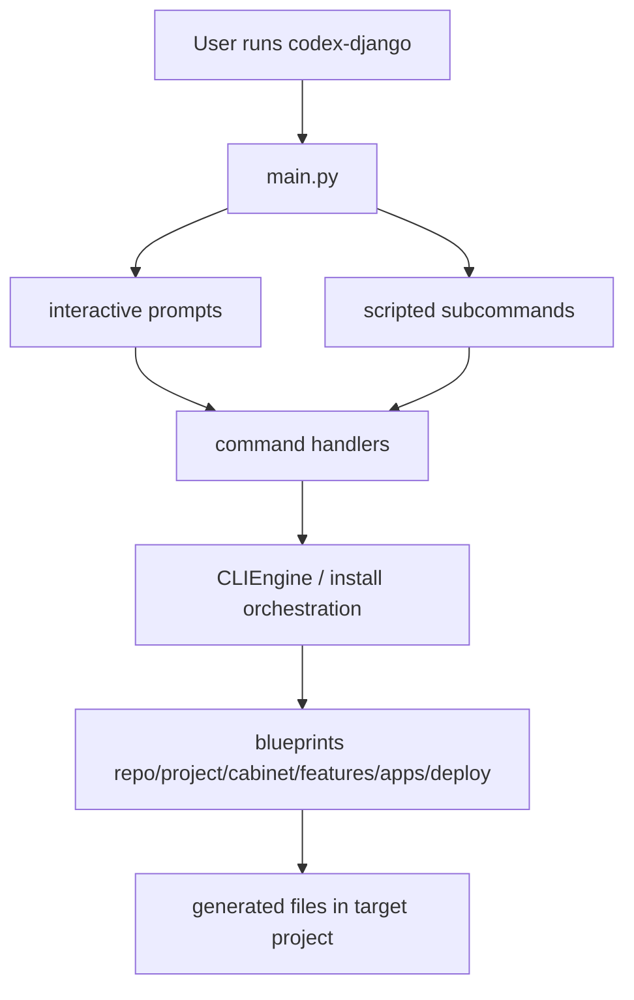

<!-- DOC_TYPE: CONCEPT -->

# Модуль CLI

## Назначение

`codex_django.cli` это слой скаффолдинга и проектных операций в репозитории.
В отличие от runtime-модулей библиотеки, CLI отвечает за генерацию структуры проекта, установку feature-слоев, генерацию repository shell files и выдачу developer workflows через интерактивный или командный интерфейс.

Архитектурно он уже настолько отличается от остальных частей проекта, что для него логично вести отдельное поддерево документации.
Это хорошо совпадает и с долгосрочным направлением, которое уже видно из кода и memory notes: позже CLI может быть вынесен в отдельную библиотеку.

## Почему CLI Заслуживает Отдельное Дерево

CLI это не просто один модуль с несколькими helper-функциями.
У него уже есть несколько внутренних слоев:

- entrypoint и menu orchestration
- prompt layer для интерактивных сценариев
- rendering/scaffolding engine
- command handlers
- blueprint library
- repo/project/feature/deploy output structures

Из-за этого он заметно отличается от модулей вроде `booking` или `conversations`, где на первом проходе достаточно одной общей архитектурной страницы.

## Основные Слои

### 1. Entry Point Layer

`main.py` это верхняя точка входа.
Именно он решает, как CLI будет работать:

- как интерактивное меню
- как repository-scoped flow расширения проекта
- как scripted subcommand interface

Это слой, который отделяет top-level tool behavior от runtime `manage.py` behavior.

### 2. Prompt Layer

`prompts.py` это тонкая интерактивная прослойка поверх `questionary`.
Ее задача не в том, чтобы реализовывать бизнес-логику, а в том, чтобы задавать menu tree и собирать пользовательские решения в тестируемой форме.

За счет этого модель взаимодействия CLI отделена от самой логики скаффолдинга.

### 3. Engine Layer

`engine.py` содержит основное rendering-ядро на базе Jinja2 blueprints.
Его роль:

- находить blueprint templates
- рендерить `.j2` файлы по context
- копировать static files
- scaffold'ить целые деревья директорий в target project

Это инфраструктурное сердце CLI.

### 4. Command Layer

`commands/` теперь сосредоточен вокруг orchestration-модулей вроде:

- `init`
- `install`
- `repo`
- `quality`
- `deploy`

Эти handlers переводят высокоуровневое пользовательское действие в конкретную операцию генерации или настройки.

### 5. Blueprint Layer

`blueprints/` это база знаний CLI.
Именно здесь лежат template trees, которые определяют, что будет сгенерировано.

Пространство blueprints уже разделено на осмысленные поддомены:

- `repo`
- `project`
- `cabinet`
- `features`
- `apps`
- `deploy`

Это один из самых сильных признаков того, что CLI нужно документировать как самостоятельное дерево.

## Дерево Документации CLI

Это поддерево уже покрывает основные CLI-зоны отдельными страницами:

- `entrypoints.md`
- `engine.md`
- `commands.md`
- `blueprints.md`
- `project-output.md`

## Внутренняя Архитектура

## Роль В Репозитории

CLI это construction-layer внутри `codex-django`.
Если runtime-модули описывают, что библиотека дает после установки, то CLI описывает, как проект собирается так, чтобы эти модули стали реально пригодны к использованию.

То есть в репозитории одновременно есть две разные архитектурные оси:

- runtime modules: `core`, `system`, `booking`, `conversations`, `cabinet`
- build/scaffolding module: `cli`

Эта разница уже достаточно сильна, чтобы дальше вести документацию CLI отдельно.
