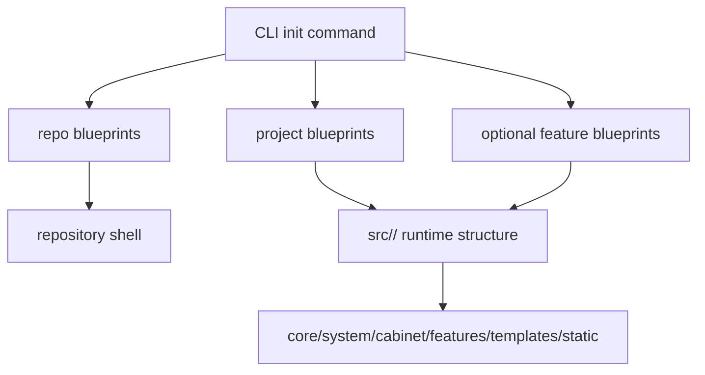

<!-- DOC_TYPE: CONCEPT -->

# CLI Project Output

## Назначение

Эта страница описывает архитектурную форму проекта, который генерирует `codex_django.cli`.
Она не про внутреннее устройство CLI.
Она про то, что реально появляется на диске после основного scaffold-flow.

Это различие важно, потому что итоговый generated project это и есть конечный продукт, который CLI поставляет разработчику.
Если blueprints это исходный материал, а `CLIEngine` это исполнитель, то project output это уже та архитектура, внутри которой потом реально живут разработчики.

## Два Уровня Выхода

CLI генерирует результат на двух разных уровнях:

- repository level
- Django project level

Их не нужно смешивать.

### Repository Level

В корне репозитория CLI может создать внешнюю оболочку проекта:

- `pyproject.toml`
- `README.md`
- `.env.example`
- `.gitignore`
- repo docs и tools
- deployment files в `deploy/<project_name>/`

Это operational и packaging-слой вокруг generated application.

### Django Project Level

Внутри `src/<project_name>/` CLI генерирует сам runtime Django project.
Именно этот код становится фактической backend-структурой приложения.

## Базовая Сгенерированная Runtime-Структура

Сейчас базовый project blueprint генерирует структуру, в центре которой находятся:

- `manage.py`
- `core/`
- `system/`
- `cabinet/`
- `features/`
- `templates/`
- `static/`

И уже это само по себе говорит о важной вещи:
generated project это не пустой Django skeleton.
Он с самого начала архитектурно opinionated.

## Смысл Основных Выходных Папок

### `core/`

`core/` это framework и settings-слой проекта.
Там лежат:

- пакеты настроек
- urls
- wsgi/asgi entrypoints
- logging/redis helpers
- sitemap wiring

Это runtime control center сгенерированного проекта.

### `system/`

`system/` это слой project-state и административных данных.
В generated output он отвечает за:

- site settings
- SEO models/admin
- static content
- management command support
- error views

Это напрямую отражает reusable `system` concepts, которые уже есть в самой библиотеке.

### `cabinet/`

`cabinet/` появляется в generated project как минимальная оболочка вокруг reusable cabinet framework.
Он не дублирует полную реализацию библиотеки.
Вместо этого он создает project-local glue и точки настройки, например:

- local cabinet registration
- минимальные selectors/views
- theme и override surface

Это важно, потому что сам cabinet должен оставаться library-driven, но при этом сохранять пространство для project-level адаптации.

### `features/`

`features/` это зона расширения generated project.
Базовый проект уже содержит `features/main/`, который выступает стартовым feature module для публичных страниц вроде home и contacts.

Позже CLI-команды могут расширять эту область через:

- standard apps
- feature bundles

Поэтому `features/` это основной growth-surface scaffolded проекта.

### `templates/`

`templates/` содержит общие шаблоны проекта, например:

- base layout
- includes
- public pages
- error pages

Этот слой задает shared rendering surface сгенерированного проекта.
Он отличен и от library-owned `cabinet` templates, и от showcase templates.

### `static/`

`static/` содержит front-end asset structure generated project.
Важно, что там уже заложена многоуровневая CSS-структура и compiler configuration, то есть организация фронтенда тоже scaffold'ится как архитектурное решение, а не оставляется полностью на усмотрение проекта.

## Опциональное Расширение Выхода

Базовый проект может расширяться уже на этапе генерации опциональными модулями:

- cabinet
- booking
- notifications

Эти модули не просто добавляют по одной папке.
Они могут внедрять файлы сразу в несколько целевых зон.

Например:

- booking расширяет runtime code, templates, cabinet integration и system configuration
- notifications добавляют feature code и ARQ-related infrastructure
- client cabinet расширяет cabinet и system-side user profile handling

То есть generated output всегда многослоен:

1. base project shell
2. optional feature bundles
3. later incremental scaffold commands

## Generated Project Как Архитектура

Ключевая архитектурная мысль такая:
CLI генерирует не нейтральный Django skeleton.
Он генерирует проект в форме codex-django, где уже зафиксированы предположения о том:

- где живут core settings
- где хранится admin/system state
- как организованы features
- как отделены public templates от cabinet UI
- как deploy-support оборачивает проект

Именно поэтому project output заслуживает отдельной страницы документации.

## Runtime Flow

## Связь С Другими CLI-Страницами

- `blueprints.md` объясняет семейства исходных blueprints, из которых строится этот output
- `engine.md` объясняет, как этот output материализуется
- `commands.md` объясняет, какие действия создают или расширяют этот output

Эта страница это взгляд "что в итоге получается" на архитектуру CLI.

## См. Также

- [CLI module](./module.md)
- [CLI blueprints](./blueprints.md)
- [CLI commands](./commands.md)
